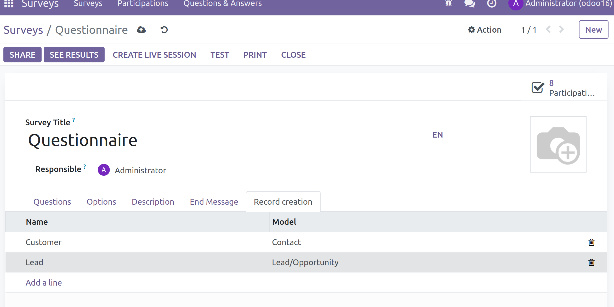
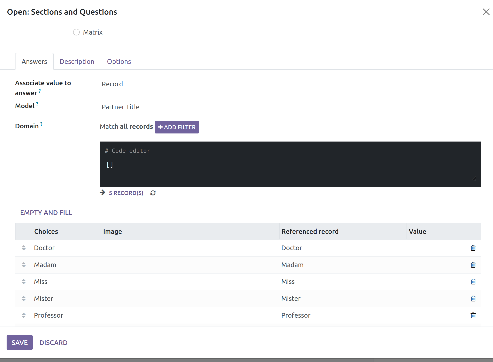

Record generation configuration
~~~~~~~~~~~~~~~~~~~~~~~~~~~~~~~

#. Go to the the survey
#. In *Record creation* tab add a new line        
#. Set a name for created record, select the Model of the record (eg: Prospect)
#. Add a field configuration. So for each field : 

    .. |Image of record creation fields| image:: ../static/description/record-creation-customer.png

    #. You can check "unicity constraint" to prevent duplicates. 
        In case of duplicates and if other record use this record to fill a m2o field, the founded record will be used
    #. You can configure explicitly where Odoo should retrieve the value of field : 
        * **fixed**: To set explicit value
        * **question**: If value come from user's answer
            For m2o or m2m links, question should be configured before. See Question answers configuration section below.
        * **other created record**: If value come from other created record (m2o case only)

Question answers configuration 
~~~~~~~~~~~~~~~~~~~~~~~~~~~~~~~

In a survey question : to configure value of choices

#. Configure a multiple choice question
#. Select value type associated to answer:
    * **Value** > eg: to fill a selection field
    * **Record** > to fill m2o or m2m field
#. In case of *record* type: 
    #. Select referenced model
    #. You can directly fill answers (eventualy with help of the domain field) 
    #. Or create new answers and set associated record
#. In case of *value* type: 
    #. Add new selectable answers and set associated value

